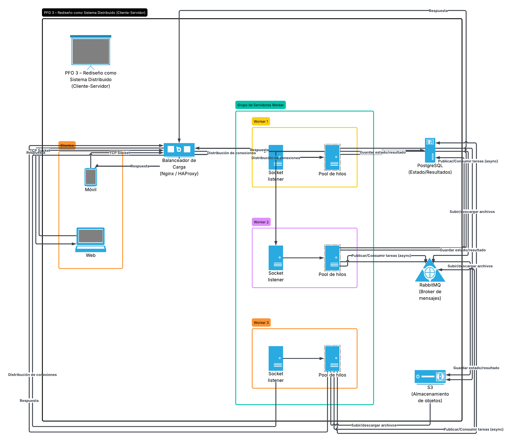

# PFO 3: Rediseño como Sistema Distribuido (Cliente-Servidor)

Este proyecto consiste en la transformación de una aplicación monolítica en una arquitectura distribuida basada en el modelo cliente-servidor mediante el uso de sockets TCP en Python.

El sistema está diseñado para ser:

- Concurrente
- Desacoplado
- Tolerante a fallos
- Capaz de gestionar múltiples peticiones simultáneamente

---

# Arquitectura del Sistema

El sistema se compone de las siguientes capas distribuidas:

## Clientes (Móviles / Web)

Interfaces de usuario desarrolladas en Tkinter que realizan peticiones mediante TCP Sockets hacia el balanceador de carga.

## Balanceador de Carga (Nginx / HAProxy)

Punto de entrada encargado de recibir las conexiones y distribuirlas equitativamente entre los servidores disponibles.

## Grupo de Servidores Worker

Servidores independientes orientados a la escucha de sockets.

Al recibir una petición:

1. Aceptan la conexión.
2. Delegan el procesamiento a un pool de hilos.
3. Continúan atendiendo nuevas solicitudes sin bloqueos.

## Cola de Mensajes (RabbitMQ)

Message Broker encargado de:

- Comunicación asíncrona entre servidores.
- Encolado de tareas pesadas.
- Desacoplamiento de componentes.

## Almacenamiento Segregado

### PostgreSQL

Persistencia de:

- Estados
- Resultados estructurados
- Información transaccional

### Amazon S3

Almacenamiento de:

- Archivos binarios
- Objetos pesados
- Recursos multimedia

---

# Diagrama Arquitectónico



> Asegurate de que el archivo `Diagrama.png` esté en la misma carpeta que el README.

---

# Requisitos Previos

Antes de ejecutar la aplicación, asegurate de tener instalado:

- Python 3.x
- Librerías estándar de Python:
  - socket
  - threading
  - tkinter
  - time

---

# Instrucciones de Ejecución

## 1. Iniciar el Servidor Central (Backend)

Abrí una terminal y ejecutá:

```bash
python servidor.py
```

Deberías visualizar:

```text
[SERVIDOR CENTRAL] Escuchando en 127.0.0.1:65432...
```

---

## 2. Lanzar los Clientes (Frontend)

Abrí una o más terminales adicionales y ejecutá:

```bash
python cliente.py
```

---

# Pruebas de Concurrencia

## Paso 1

Abrí dos ventanas de cliente simultáneamente.

## Paso 2

Enviá una tarea desde el primer cliente.

## Paso 3

Inmediatamente enviá otra tarea desde el segundo cliente.

## Resultado Esperado

Verificá en la consola del servidor que ambas solicitudes son procesadas en paralelo mediante distintos hilos:

```text
Thread-1
Thread-2
Thread-3
```

Además:

- Las interfaces gráficas permanecen responsivas.
- No aparece el estado "No responde".
- La comunicación por sockets se realiza mediante hilos no bloqueantes.

---

# Tecnologías Utilizadas

- Python 3
- TCP Sockets
- Threading
- Tkinter
- RabbitMQ
- PostgreSQL
- Amazon S3
- Nginx / HAProxy

---

# Objetivo

Demostrar la evolución de una aplicación monolítica hacia una arquitectura distribuida cliente-servidor capaz de soportar concurrencia, escalabilidad y procesamiento asíncrono.
